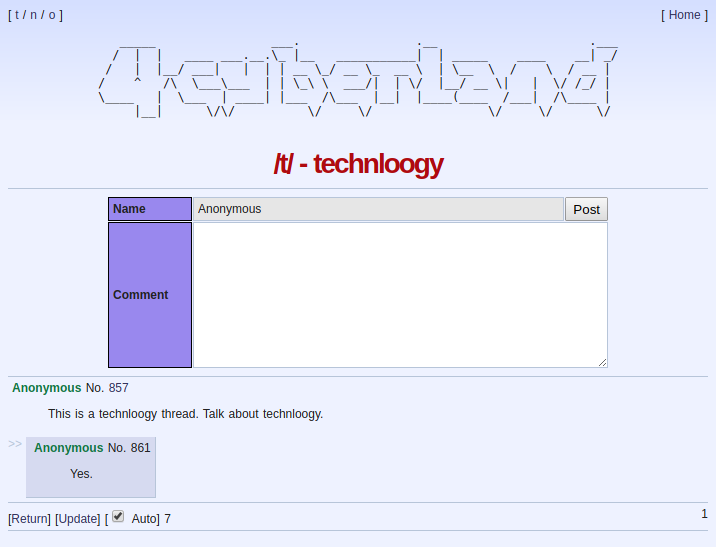

# 4cyberland

A straight frontend for cyberland.club



- Boards organized in threads.
- Progressive board loading. Most recent replies to threads are loaded as soon
  as the thread appears on screen. This probably makes this the fastest client.
- Auto load feature in threads. Loads new posts automatically.
- Safe from XSS

There's only one restriction right now. You cannot see replies to posts. You can
only see replies to threads.

## Build Setup

Assuming you have Node.js installed, run the following commands to get this up
and running quickly:

```bash
# install dependencies
$ npm install

# serve with hot reload at localhost:3000
$ npm run dev
```

For production:

```bash
# install dependencies
$ npm install

# build for production.
$ npm run build

# launch server
$ npm run start
```

## Custom settings

Create a file called `.env` and change any of the settings you want:

```bash
# Base url for the cyberland API.
CYBERLAND_API_BASE_URL=https://cyberland.club/
```